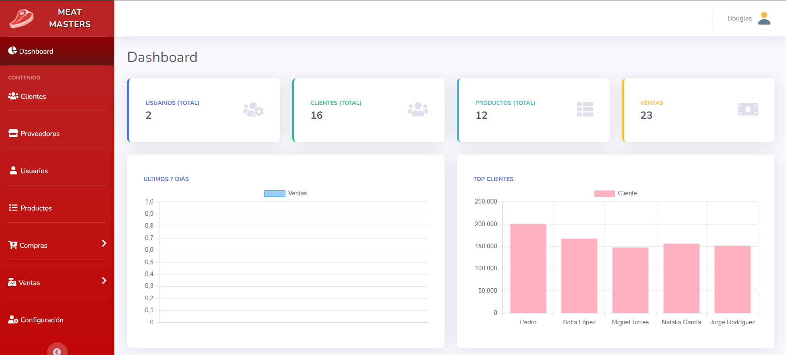

# 🥩 Sistema de Venta para Carnicería

Bienvenido al **Sistema de Venta y Inventario para Carnicería**. Este es un sistema completo de punto de venta (POS) y administración de inventario diseñado específicamente para gestionar las operaciones de un expendio de carnes. Desarrollado con tecnologías web modernas, ofrece una interfaz intuitiva y potentes herramientas de gestión.

## Características Principales

El sistema cuenta con múltiples módulos para cubrir todas las necesidades del negocio:

- **Dashboard Administrativo**: Vista general del estado del negocio con gráficos y estadísticas clave.
- **Punto de Venta (POS)**: Interfaz rápida para realizar ventas, generar facturas y controlar el flujo de caja.
- **Gestión de Productos**: Control detallado del inventario de cortes de carne y otros productos.
- **Clientes y Proveedores**: Administración de base de datos de clientes y proveedores para seguimiento y contacto.
- **Compras**: Registro de adquisiciones de mercancía para mantener el stock actualizado.
- **Usuarios y Roles**: Gestión de usuarios con diferentes niveles de acceso y seguridad.
- **Reportes**: Generación de reportes de ventas y movimientos.

## Tecnologías Utilizadas

- **Lenguaje**: PHP 8
- **Base de Datos**: MySQL
- **Arquitectura**: MVC (Modelo-Vista-Controlador)
- **Frontend**: HTML5, CSS3, JavaScript
- **Librerías**:
  - **Axios**: Para peticiones asíncronas rápidas al servidor.
  - **Bootstrap**: Para, diseño responsivo y componentes de UI.
  - **Fpdf**: Para la generación de reportes y facturas en PDF.

## Capturas de Pantalla

### Dashboard General

Una vista clara de las métricas importantes.


### Lista de Ventas

Historial detallado de todas las transacciones realizadas.


### Factura de Venta

Generación de comprobantes profesionales para los clientes.


## 🛠️ Instalación y Configuración

Siga estos pasos para desplegar el proyecto en su entorno local:

1.  **Clonar el Repositorio**

    ```bash
    git clone https://github.com/tu-usuario/nombre-del-repo.git
    cd sistema-de-venta-php-axios-y-mysql-mvc
    ```

2.  **Instalar Dependencias**
    Asegúrese de tener [Composer](https://getcomposer.org/) instalado y ejecute:

    ```bash
    composer install
    ```

3.  **Configurar Variables de Entorno**
    Copie el archivo de ejemplo y configure sus credenciales de base de datos:

    ```bash
    cp .env.example .env
    ```

    Edite el archivo `.env` con su editor de texto y ajuste `DB_HOST`, `DB_NAME`, `DB_USER`, y `DB_PASS`.

4.  **Base de Datos**
    Importe el esquema de la base de datos en su servidor MySQL.

    > _Nota: Verifique si existe un archivo `.sql` en la raíz o solicite el esquema al administrador si no está incluido._

5.  **Ejecutar**
    Si usa Apache/XAMPP, asegúrese de que la carpeta del proyecto esté en `htdocs` y acceda desde el navegador.

---

